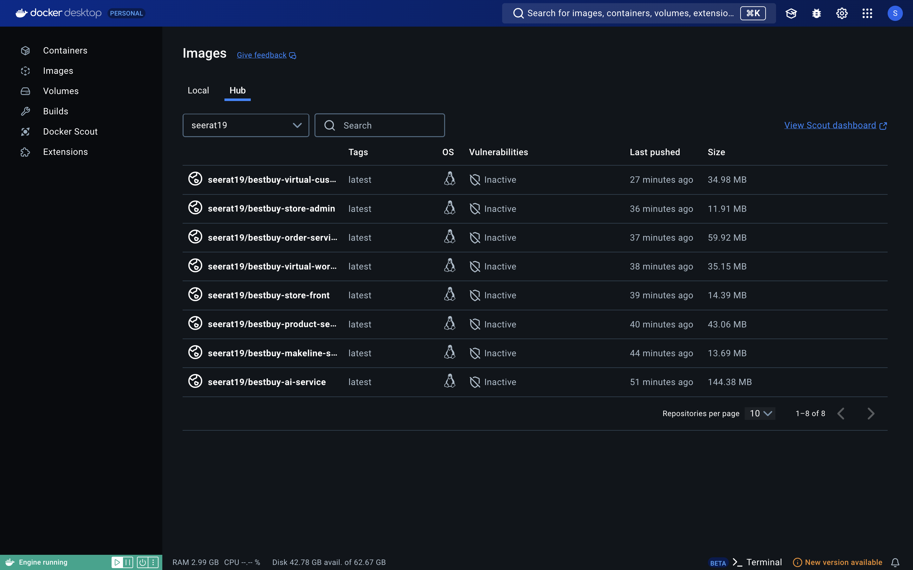

# Full Stack - Assignment 2 
# Submitted By:- Seerat Sawhney ( Student Id: 041107886 )
# Best Buy Cloud-Native Application

## **Introduction**

Welcome to the Best Buy Cloud-Native Application project! This document details the deployment and management of a microservices-based architecture for Best Buy’s online store, enriched with modern cloud-native practices. The project demonstrates the use of Kubernetes for container orchestration, Azure Service Bus for order queuing, and Azure OpenAI for AI-powered functionalities.

---
## Step 1: Clone the BestBuyApplication Repository
To begin, clone the [**BestBuyApp**]  repository, which contains all necessary deployment files.

 **Review the Deployment Files**:
   - Navigate to the `Deployment Files` folder
   - This folder contains YAML files for deploying all necessary Kubernetes resources, including services, deployments, StatefulSets, ConfigMaps, and Secrets.

## **Updated Application Architecture**
## Architecture

The application has the following services: 

| Service | Description | Github Repo |
| --- | --- | --- |
| `store-front` | Web app for customers to place orders (Vue.js) | link |
| `store-admin` | Web app used by store employees to view orders in queue and manage products (Vue.js) |  |
| `order-service` | This service is used for placing orders (Javascript) |  |
| `product-service` | This service is used to perform CRUD operations on products (Rust) |  |
| `makeline-service` | This service handles processing orders from the queue and completing them (Golang) |  |
| `ai-service` | Optional service for adding generative text and graphics creation (Python) |  |
| `rabbitmq` | RabbitMQ for an order queue |  |
| `mongodb` | MongoDB instance for persisted data |  |
| `virtual-customer` | Simulates order creation on a scheduled basis (Rust) |  |
| `virtual-worker` | Simulates order completion on a scheduled basis (Rust) |  |


### **Architecture Diagram**


### **Application Components**

| **Service**           | **Description**                                                       |
| --------------------- | --------------------------------------------------------------------- |
| **Store-Front**       | Customer-facing application for browsing and placing orders.          |
| **Store-Admin**       | Employee-facing application for managing products and viewing orders. |
| **Order-Service**     | Handles order creation and sends data to the managed order queue.     |
| **Product-Service**   | Manages CRUD operations for product data.                             |
| **Makeline-Service**  | Processes and completes orders by reading from the order queue.       |
| **AI-Service**        | Generates product descriptions and images using GPT-4 and DALL-E.     |
| **Database**          | MongoDB for persisting order and product data.                        |
| **Azure Service Bus** | Managed service for reliable order queuing.                           |

---

## **Application Functionality**

The Best Buy Cloud-Native Application provides:

- **Customer Features:**
  - Seamless browsing with AI-generated product descriptions and images.
  - Efficient order placement and processing.

- **Employee Tools:**
  - Inventory management and order tracking.
  - Real-time insights into order processing.

- **Cloud-Native Enhancements:**
  - Scalable microservices architecture.
  - Managed Azure resources for reliability and performance.

---
## Step 2: Create an Azure Kubernetes Cluster (AKS)

1. **Log in to Azure Portal:**
   - Go to [https://portal.azure.com](https://portal.azure.com) and log in with your Azure account.

2. **Create a Resource Group:**
   - In the Azure Portal, search for **Resource Groups** in the search bar.
   - Click **Create** and fill in the following:
     - **Resource group name**: `AlgonquinPetStoreRG`
     - **Region**: `Canada`.
   - Click **Review + Create** and then **Create**.

3. **Create an AKS Cluster:**
   - In the search bar, type **Kubernetes services** and click on it.
   - Click **Create** and select **Kubernetes cluster**
   - In the `Basics` tap fill in the following details:
     - **Subscription**: Select your subscription.
     - **Resource group**: Choose `bestbuyseerat`.
     - **Cluster preset configuration**: Choose `Dev/Test`.
     - **Kubernetes cluster name**: `bestbuylusterseerat`.
     - **Region**: Same as your resource group (e.g., `Canada`).
     - **Availability zones**: `None`.
     - **AKS pricing tier**: `Free`.
     - **Kubernetes version**: `Default`.
     - **Automatic upgrade**: `Disabled`.
     - **Automatic upgrade scheduler**: `No schedule`.
     - **Node security channel type**: `None`.
     - **Security channel scheduler**: `No schedule`.
     - **Authentication and Authorization**: `Local accounts with Kubernetes RBAC`.
   - In the `Node pools` tap fill in the following details:
     - Select **agentpool**. Optionally change its name to `masterpool`. This nodes will have the controlplane.
        - Set **node size** to `D2as_v4`.
        - **Scale method**: `Manual`
        - **Node count**: `1`
        - Click `update`
     - Click on **Add node pool**:
        - **Node pool name**: `workerspool`.
        - **Mode**: `User` 
        - Set **node size** to `D2as_v4`.
        - **Scale method**: `Manual`
        - **Node count**: `2`
        - Click `add`
   - Click **Review + Create**, and then **Create**. The deployment will take a few minutes.
     

4. **Connect to the AKS Cluster:**
   - Once the AKS cluster is deployed, navigate to the cluster in the Azure Portal.
   - In the overview page, click on **Connect**. 
   - Select **Azure CLI** tap. You will need Azure CLI. If you don't have it: [**Install Azure CLI**](https://learn.microsoft.com/en-us/cli/azure/install-azure-cli?view=azure-cli-latest)
   - Login to your azure account using the following command:
      ```
      az login
      ```
   - Set the cluster subscription using the command shown in the portal (it will look something like this):
      ```
      az account set --subscription 'subscribtion-id'
      ```

   - Copy the command shown in the portal for configuring `kubectl` (it will look something like this):
     ```
     az aks get-credentials --resource-group AlgonquinPetStoreRG --name AlgonquinPetStoreCluster
     ```
      **Understanding the Command:**
      - The command `az aks get-credentials` pulls the necessary configuration files to enable `kubectl` to access your AKS cluster. Here’s a breakdown:
     - `--resource-group` specifies the resource group where your AKS cluster resides.
     - `--name` specifies the name of your AKS cluster.
     - `--overwrite-existing` can be used to overwrite any existing Kubernetes configuration files for the same cluster. This is useful if you’ve connected to the cluster before or if multiple configurations exist for it.
   - Verify Cluster Access:
      - Test your connection to the AKS cluster by listing all nodes:
        ```
        kubectl get nodes
        ```
        You should see details of the nodes in your AKS cluster if the connection is successful.

---
## Docker
## Testing and Validation

### **Step 1: Construct Docker Images for All Repositories**

```bash
```bash
docker build -t bestbuy-ai-service:latest .  
docker build -t bestbuy -makeline-service:latest . 
docker build -t bestbuy -product-service:latest . 
docker build -t bestbuy -store-front:latest . 
docker build -t bestbuy -virtual-worker:latest . 
docker build -t bestbuy -order-service:latest .  
docker build -t bestbuy -store-admin:latest .  
docker build -t bestbuy -virtual-customer:latest .

```
### Step 2: Assign Tags to Docker Images
```bash

docker tag bestbuy-ai-service:latest seerat19/ bestbuy-ai-service:latest 
docker tag bestbuy-makeline-service:latest seerat19/ bestbuy-makeline-service:latest 
docker tag bestbuy-product-service:latest seerat19/ bestbuy-product-service:latest 
docker tag bestbuy-store-front:latest seerat19/ bestbuy-store-front:latest
docker tag bestbuy-virtual-worker:latest seerat19/ bestbuy-virtual-worker:latest 
docker tag bestbuy-order-service:latest seerat19/ bestbuy-order-service:latest 
docker tag bestbuy-store-admin:latest seerat19/ bestbuy-store-admin:latest 
docker tag bestbuy-virtual-customer:latest seerat19/ bestbuy-virtual-customer:latest

```
### Step 3: Upload Docker Images to the Repository
```bash


docker push seerat19/bestbuy-ai-service:latest 
docker push seerat19/ bestbuy-makeline-service:latest 
docker push seerat19/ bestbuy-product-service:latest 
docker push seerat19/ bestbuy-store-front:latest
docker push seerat19/ bestbuy-virtual-worker:latest 
docker push seerat19/ bestbuy-order-service:latest 
docker push seerat19/ bestbuy-store-admin:latest 
docker push seerat19/ bestbuy-virtual-customer:latest 

```

## **Microservices and Docker Images**

| **Service**          | **Docker Image  Link**     | 
| -------------------- | -------------------------- | 
| **Store-Front**      | https://hub.docker.com/r/seerat19/bestbuy-store-front/tags | 
| **Order-Service**    | https://hub.docker.com/r/seerat19/bestbuy-order-service/tags | 
| **Product-Service**  | https://hub.docker.com/r/seerat19/bestbuy-product-service/tags | 
| **Makeline-Service** | https://hub.docker.com/r/seerat19/bestbuy-makeline-service/tags | 
| **Store-admin**      | https://hub.docker.com/r/seerat19/bestbuy-store-admin/tags | 
| **AI-Service**       | https://hub.docker.com/r/seerat19/bestbuy-ai-service/tags | 
| **Virtual-Customer** | https://hub.docker.com/r/seerat19/bestbuy-virtual-customer/tags | 
| **Virtual-worker**   |  https://hub.docker.com/r/seerat19/bestbuy-virtual-worker/tags| 

---
## Docker


---


## 3. Set Up AI Backing Services 
## Azure OpenAI Service

### Task 1: Create an Azure OpenAI Service Instance

1. **Navigate to Azure Portal**:
   - Go to the [Azure Portal](https://portal.azure.com/).

2. **Create a Resource**:
   - Select **Create a Resource** from the Azure portal dashboard.
   - Search for **Azure OpenAI**
   

3. **Set Up the Azure OpenAI Resource**:
   - Choose the **East US** region for deployment to ensure capacity for GPT-4 and DALL-E 3 models.
   - Fill in the required details:
     - Resource group: Use an existing one or create a new group.
     - Pricing tier: Select `Standard`.

4. **Deploy the Resource**:
   - Click **Review + Create** and then **Create** to deploy the Azure OpenAI service.

---


### Task 2: Deploy the GPT-4 and DALL-E 3 Models

1. **Access the Azure OpenAI Resource**:
   - Navigate to the Azure OpenAI resource you just created.

2. **Deploy GPT-4**:
   - Go to the **Model Deployments** section and click **Add Deployment**.
   - Choose **GPT-4** as the model and provide a deployment name (e.g., `gpt-4-deployment`).
   - Set the deployment configuration as required and deploy the model.

3. **Deploy DALL-E 3**:
   - Repeat the same process to deploy **DALL-E 3**.
   - Use a descriptive deployment name (e.g., `dalle-3-deployment`).

4. **Note Configuration Details**:
   - Once deployed, note down the following details for each model:
     - Deployment Name
     - Endpoint URL

---

### Task 3: Retrieve and Configure API Keys

1. **Get API Keys**:
   - Go to the **Keys and Endpoints** section of your Azure OpenAI resource.
   - Copy the **API Key (API key 1)** and **Endpoint URL**.

2. **Base64 Encode the API Key**:
   - Use the following command to Base64 encode your API key:
     ```bash
     echo -n "<your-api-key>" | base64
     ```
   - Replace `<your-api-key>` with your actual API key.

---

### Task 4: Update AI Service Deployment Configuration in the `Deployment Files` folder.
1. **Modify Secretes YAML**:
   - Edit the `secrets.yaml` file.
   - Replace `OPENAI_API_KEY` placeholder with the Base64-encoded value of the `API_KEY`. 
2. **Modify Deployment YAML**:
   - Edit the `aps-all-in-one.yaml` file.
   - Replace the placeholders with the configurations you retrieved:
     - `AZURE_OPENAI_DEPLOYMENT_NAME`: Enter the deployment name for GPT-4.
     - `AZURE_OPENAI_ENDPOINT`: Enter the endpoint URL for the GPT-4 deployment.
     - `AZURE_OPENAI_DALLE_ENDPOINT`: Enter the endpoint URL for the DALL-E 3 deployment.
     - `AZURE_OPENAI_DALLE_DEPLOYMENT_NAME`: Enter the deployment name for DALL-E 3.

   Example configuration in the YAML file:
   ```yaml
   - name: AZURE_OPENAI_API_VERSION
     value: "2024-07-01-preview"
   - name: AZURE_OPENAI_DEPLOYMENT_NAME
     value: "gpt-4-deployment"
   - name: AZURE_OPENAI_ENDPOINT
     value: "https://<your-openai-resource-name>.openai.azure.com/"
   - name: AZURE_OPENAI_DALLE_ENDPOINT
     value: "https://<your-openai-resource-name>.openai.azure.com/"
   - name: AZURE_OPENAI_DALLE_DEPLOYMENT_NAME
     value: "dalle-3-deployment"
   ```

   ## Step 4: Deploy the ConfigMaps and Secrets
- Deploy the ConfigMap for RabbitMQ Plugins:
   ```bash
   kubectl apply -f config-maps.yaml
   ```
- Create and Deploy the Secret for OpenAI API:  
   - Make sure that you have replaced Base64-encoded-API-KEY in secrets.yaml with your Base64-encoded OpenAI API key.
   ```bash
   kubectl apply -f secrets.yaml
   ```
- Verify:
   ```bash
   kubectl get configmaps
   kubectl get secrets
   ```

## Step 5: Deploy the Application
   ```bash
   kubectl apply -f aps-all-in-one.yaml

### Validate the Deployment
- Check Pods and Services:
   ```bash
   kubectl get pods
   kubectl get services
   ```
- Test Frontend Access:
   - Locate the external IPs for store-front and store-admin services:
   ```bash
   kubectl get services
   ```
   - Access the Store Front app at the external IP on port 80.
   - Access the Store Admin app at the external IP on port 80.
## Step 6: Deploy Virtual Customer and Worker
   ```bash
   kubectl apply -f admin-tasks.yaml
   ```
- Monitor Virtual Customer:
   ```bash
   kubectl logs -f deployment/virtual-customer
   ```
- Monitor Virtual Worker:
   ```bash
   kubectl logs -f deployment/virtual-worker
   ```
   ## Step 7: Scale and Monitor Services
### Scale Deployments:
- Scale the `order-service` to 3 replicas:
```bash
kubectl scale deployment order-service --replicas=3
```
- Check Scaling:
```bash
kubectl get pods
```
- Monitor Resource Usage:

   - Enable metrics server for resource monitoring.
   - Use kubectl top to monitor pod and node usage:
   ```bash
   kubectl top pods
   kubectl top nodes
   ```

## Step 8: Explore Advanced Features
### AI-Generated Descriptions and Images:
- Use the AI Service for generating product descriptions and images.
- Ensure your OpenAI API key is correctly configured in the deployed secret.
### RabbitMQ Management:
- Access the RabbitMQ management UI:
   ```bash
   kubectl port-forward service/rabbitmq 15672:15672
   ```
   The kubectl port-forward command is used to forward a local port to a port on a Kubernetes resource (e.g., a Pod or Service). This allows you to access the application running in the cluster from your local machine without exposing it externally.


- Login with the default credentials (`username`/`password`).

### MongoDB Shell Access and Database Exploration
In this section, you will use the MongoDB shell to interact with the `orderdb` database, which stores order information for the Algonquin Pet Store application. Follow the steps below to connect to the MongoDB pod and explore its contents.

#### **1- Access the MongoDB Shell**
Run the following command to connect to the MongoDB shell inside the running MongoDB pod:
```bash
kubectl exec -it <mongodb-pod-name> -- mongo
```
Explanation: This command uses kubectl exec to open an interactive shell (-it) inside the MongoDB pod and starts the MongoDB shell program (mongo).

#### **2- List All Databases**
Once inside the MongoDB shell, run:
```bash
show dbs
```
Explanation: The show dbs command lists all databases available on the MongoDB server. You should see a list that includes the orderdb, which stores order-related data for the application.
#### **3- Switch to the Order Database**
```bash
use orderdb
```
Explanation: The use orderdb command selects the orderdb database, making it the active database for subsequent queries and commands.
#### **4- List Collections in the Database**
Display all collections in the orderdb database:
```bash
show collections
```
Explanation: The show collections command lists all collections (similar to tables in relational databases) in the current database. The orders collection contains the order data.
#### **5- Query the Orders Collection**
Retrieve all documents in the orders collection:
```bash
db.orders.find()
```
Explanation: The db.orders.find() command fetches and displays all documents (records) in the orders collection. This allows you to view the stored order data, including details such as customer information, products, and order status.

#### By following these steps, you will:
- Connect to the MongoDB shell in the Kubernetes pod.
- Explore the databases and collections used by the application.
- Query the orders collection to examine the data structure and stored records.
  


---

## **Demo Video**

- [Demo Video Link](youtube-link)

  


